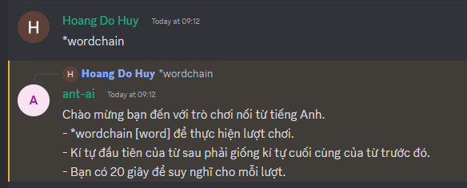
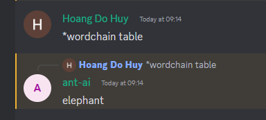
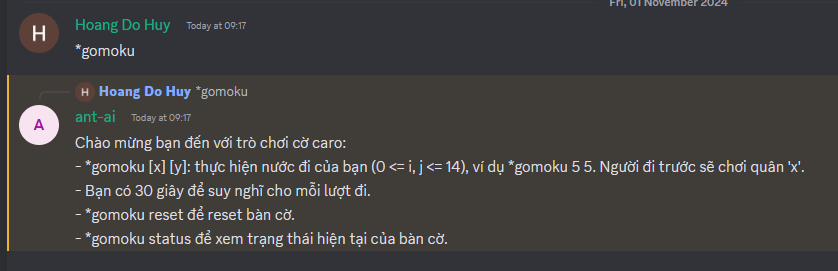
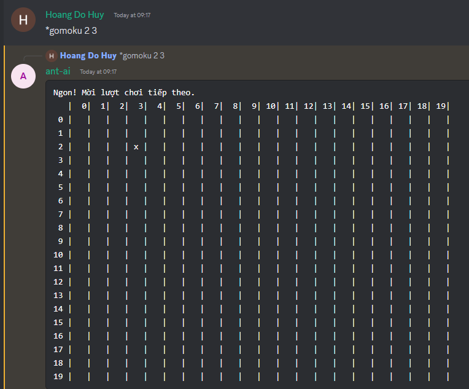
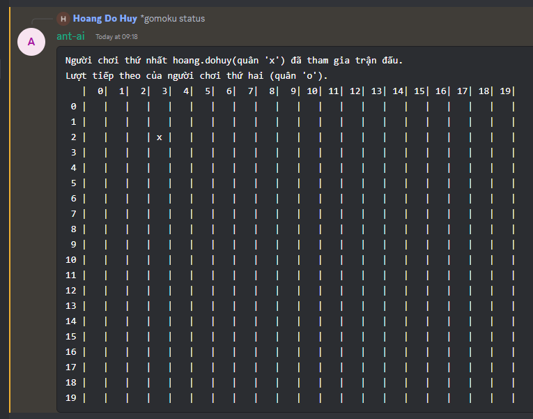

## Create your Mezon application

Visit the [Developers Portal](https://dev-developers.nccsoft.vn/) to create your application.

## Add bot to your clan

Use your install link in a browser to add your bot to your desired clan.

## Installation

```bash
$ yarn
```

Copy `.env.example` to `.env` and replace it with your application token.

## Running the app

```bash
# development
$ yarn start
```

## Wordchain
```
*wordchain to see instruction of Wordchain
```


```
*wordchain [word] to play the game
```


## Gomoku
```
*gomoku to see instruction of Gomoku
```


```
*gomoku [x] [y] to play the game
```


*gomoku status to check status of  the game


```
*gomoku reset to reset match
```

These 2 game is managed on each channel.